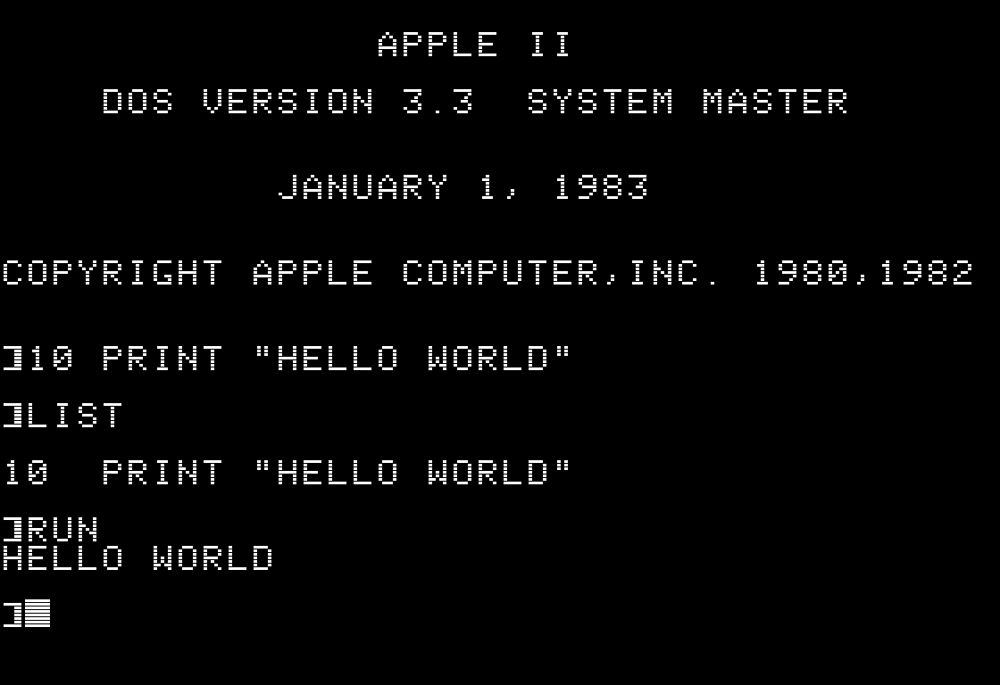

# Apple ][+, //e emulator

Portable emulator of an Apple II+ or //e. Written in Go.

[](https://circleci.com/gh/ivanizag/apple2/tree/master)

## Features

- Models:
    - Apple ][+ with 48Kb of base RAM
    - Apple //e with 128Kb of RAM
    - Apple //e enhanced with 128Kb of RAM
    - Base64A clone with 48Kb of base RAM and paginated ROM
- Storage
    - 16 Sector diskettes in DSK format
    - ProDos hard disk
- Emulated extension cards:
    - DiskII controller
    - 16Kb Language Card
    - 256Kb Saturn RAM 
    - ThunderClock Plus real time clock
    - Bootable hard disk card
    - Apple //e 80 columns with 64Kb extra RAM
    - VidHd, limited to the ROM signature and SHR as used by Total Replay, only for //e models with 128Kb
    - FASTChip, limited to what Total Replay needs to set and clear fast mode
- Graphic modes:
    - Text 40 columns
    - Text 80 columns (Apple //e only)
    - Low-Resolution graphics
    - Double-Width Low-Resolution graphics (Apple //e only)
    - High-Resolution graphics
    - Double-Width High-Resolution graphics (Apple //e only)
    - Super High Resolution (VidHD only)
    - Mixed mode
- Displays:
    - Green monochrome monitor with half width pixel support
    - NTSC Color TV (extracting the phase from the mono signal)
    - RGB for Super High Resolution
    - ANSI Console, avoiding the SDL2 dependency
- Other features:
    - Sound
    - Joystick support. Up to two joysticks or four paddles.
    - Adjustable speed.
    - Fast disk mode to set max speed while using the disks. 
    - Single file executable with embedded ROMs and DOS 3.3


## Running the emulator

No installation required. [Download](https://github.com/ivanizag/apple2/releases) the single file executable `apple2xxx_xxx` for linux or Mac, SDL2 graphics or console. Build from source to get the latest features.

### Default mode

Execute without parameters to have an emulated Apple II+ with 64kb booting DOS 3.3 ready to run Applesoft:
```
casa@servidor:~$ ./apple2sdl
```



### Play games
Download a DSK file locally or use an URL ([Asimov](https://www.apple.asimov.net/images/) is an excellent source) with the `-disk` parameter:
```
casa@servidor:~$ ./apple2sdl -disk "https://www.apple.asimov.net/images/games/action/karateka/karateka (includes intro).dsk"
```


### Play the Total Replay collection
Download the excellent [Total Replay](https://archive.org/details/TotalReplay) compilation by
[a2-4am](https://github.com/a2-4am/4cade). Run it with the `-hd` parameter:
```
casa@servidor:~$ ./apple2sdl -hd "Total Replay v2.0.2mg"
```
Displays super hi-res box art as seen with the VidHD card.


### Terminal mode
To run text mode right on the terminal without the SDL2 dependency, use `apple2console`. It runs on the console using ANSI escape codes. Input is sent to the emulated Apple II one line at a time: 
```
casa@servidor:~$ ./apple2console

############################################
#                                          #
#                APPLE II                  #
#                                          #
#     DOS VERSION 3.3  SYSTEM MASTER       #
#                                          #
#                                          #
#            JANUARY 1, 1983               #
#                                          #
#                                          #
# COPYRIGHT APPLE COMPUTER,INC. 1980,1982  #
#                                          #
#                                          #
# ]10 PRINT "HELLO WORLD"                  #
#                                          #
# ]LIST                                    #
#                                          #
# 10  PRINT "HELLO WORLD"                  #
#                                          #
# ]RUN                                     #
# HELLO WORLD                              #
#                                          #
# ]_                                       #
#                                          #
#                                          #
############################################
Line: 

```

### Keys

- Ctrl-F1: Reset button
- F5: Toggle speed between real and fastest
- Ctrl-F5: Show current speed in Mhz
- F6: Toggle between NTSC color TV and green phosphor monochrome monitor
- F7: Save current state to disk
- F8: Restore state from disk
- F10: Cycle character generator codepages. Only if the character generator ROM has more than one 2Kb page.
- F11: Toggle on and off the trace to console of the CPU execution
- F12: Save a screen snapshot to a file `snapshot.png`

Only valid on SDL mode

### Command line options

```
  -charRom string
        rom file for the character generator (default "<internal>/Apple2rev7CharGen.rom")
  -disk string
        file to load on the first disk drive (default "<internal>/dos33.dsk")
  -disk2Slot int
        slot for the disk driver. -1 for none. (default 6)
  -diskRom string
        rom file for the disk drive controller (default "<internal>/DISK2.rom")
  -dumpChars
        shows the character map
  -fastDisk
        set fast mode when the disks are spinning (default true)
  -hd string
        file to load on the hard disk
  -hdSlot int
        slot for the hard drive if present. -1 for none. (default -1)
  -languageCardSlot int
        slot for the 16kb language card. -1 for none
  -mhz float
        cpu speed in Mhz, use 0 for full speed. Use F5 to toggle. (default 1.0227142857142857)
  -model string
        set base model. Models available 2plus, 2e, 2enh, base64a (default "2enh")
  -mono
        emulate a green phosphor monitor instead of a NTSC color TV. Use F6 to toggle.
  -panicSS
        panic if a not implemented softswitch is used
  -profile
        generate profile trace to analyse with pprof
  -rom string
        main rom file (default "<internal>/Apple2_Plus.rom")
  -saturnCardSlot int
        slot for the 256kb Saturn card. -1 for none (default -1)
  -thunderClockCardSlot int
        slot for the ThunderClock Plus card. -1 for none (default 4)
  -traceCpu
        dump to the console the CPU execution. Use F11 to toggle.
  -traceHD
        dump to the console the hd commands
  -traceSS
        dump to the console the sofswitches calls
  -vidHDSlot int
    	  slot for the VidHD card, only for //e models. -1 for none (default 2)


```

## Building from source

### apple2console

The only dependency is having a working Go installation on any platform.

Run:
```
$ go get github.com/ivanizag/apple2/apple2console 
$ go build github.com/ivanizag/apple2/apple2console 
``` 

### apple2sdl

Besides having a working Go installation, install the SDL2 developer files. Valid for any platform

Run:
```
$ go get github.com/ivanizag/apple2/apple2sdl
$ go build github.com/ivanizag/apple2/apple2sdl 
```

### Cross compile apple2sdl.exe for Windows in Ubuntu

Install the mingw cross compile tools and the [SDL2 Windows libs for mingw](https://www.libsdl.org/download-2.0.php).
```
$ sudo apt install mingw-w64
$ wget https://www.libsdl.org/release/SDL2-devel-2.0.9-mingw.tar.gz
$ tar -xzf SDL2-devel-2.0.9-mingw.tar.gz
$ sudo cp -r SDL2-2.0.9/x86_64-w64-mingw32/* /usr/x86_64-w64-mingw32
```
Compile:
```
$ env CGO_ENABLED=1 CC=x86_64-w64-mingw32-gcc GOOS=windows CGO_LDFLAGS="-L/usr/x86_64-w64-mingw32/lib -lSDL2 --verbose" CGO_FLAGS="-I/usr/x86_64-w64-mingw32/include -D_REENTRANT" go build -o apple2sdl.exe -x github.com/ivanizag/apple2/apple2sdl
```
To run the executable in Windows, copy the file `SDL2.dll` on the same folder. The latest `SDL2.dll` can be found in the [Runtime binary for Windows 64-bit](https://www.libsdl.org/download-2.0.php).
